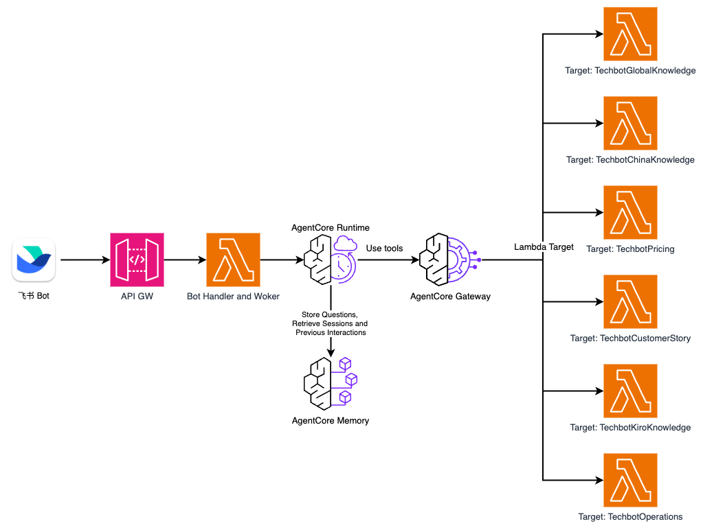

# AWS TechBot

[](LICENSE)
[](deploy/template.yaml)
[](https://docs.aws.amazon.com/bedrock-agentcore/latest/devguide/)
[](https://github.com/strands-agents/sdk-python)

English | [简体中文](README.md)

An AI-powered AWS technical assistant built with [Strands Agents SDK](https://github.com/strands-agents/sdk-python) and [Amazon Bedrock AgentCore](https://docs.aws.amazon.com/bedrock-agentcore/latest/devguide/).

Tools are managed through AgentCore Gateway — the Agent automatically discovers all available tools at startup.

## Use Cases

- **Documentation Lookup** — @mention the bot in Feishu/Lark to query AWS service docs, best practices, and architectural guidance
- **Configuration & Tutorials** — Look up configuration steps, tutorials, and sample code for AWS services
- **Cost Estimation** — Real-time pricing queries for both AWS Global and China regions
- **Troubleshooting** — Quickly find troubleshooting guides, quota limits, error codes, and operational SOPs

## Deployment

### Prerequisites: Create a Feishu/Lark App

Before deploying, create an app on the Feishu Open Platform to get the App ID and App Secret:

1. Go to [Feishu Open Platform](https://open.feishu.cn/app?lang=en-US) and create an enterprise app
2. Go to **Credentials & Basic Info**, copy **App ID** and **App Secret**
3. Enable **Bot** capability
4. Configure permissions
5. Copy Verification Code

> See the [Feishu Bot Setup Guide](docs/feishu-setup-zh.md) (Steps 1-5) for detailed instructions

### One-Click CloudFormation Deployment

| Region | Deploy |
|--------|--------|
| US West (Oregon) | [](https://us-west-2.console.aws.amazon.com/cloudformation/home?region=us-west-2#/stacks/quickcreate?templateURL=https://haomiaoj-yuzeli-aws-techbot-us-west-2.s3.us-west-2.amazonaws.com/template.yaml&stackName=TechBot) |

Click the button and fill in the parameters. The stack creates:
- **AgentCore Gateway** — Unified MCP tool endpoint + Cognito auth
- **Gateway Targets** — 4 Lambdas (Global Knowledge, China Knowledge, Pricing, Customer Stories)
- **AgentCore Runtime** — Runs the TechBot container
- **AgentCore Memory** (optional) — Multi-turn conversation memory
- **API Gateway** — `/chat` POST endpoint for Feishu webhook
- **Handler Lambda** — Receives Feishu events, filters @all, async invokes worker
- **Worker Lambda** — Calls AgentCore, updates Feishu card with response

**Parameters:**

| Parameter | Required | Description |
|-----------|----------|-------------|
| Model ID | Pre-filled GLM-5 (Best Performance) | Nova 2 Lite, GLM-5, MiniMax M2.5 (only Nova 2 Lite supports image input) |
| Enable Memory | Pre-filled true | `true` for multi-turn memory, `false` for stateless |
| Memory Expiry Days | Pre-filled 30 days | Memory expiry in days (7-365) |
| Feishu App ID | **Required** | Feishu app credentials |
| Feishu App Secret | **Required** | Feishu app credentials |
| Feishu Verification Token | **Required** | Feishu webhook verification token (Open Platform → Events & Callbacks → Encryption Strategy) |

- Leave all other options (Tags, Permissions, Stack failure options, etc.) as default.
- Check **✅ I acknowledge that AWS CloudFormation might create IAM resources with custom names** at the bottom.
- Click **Create stack** and wait for `CREATE_COMPLETE` (~5 minutes).

### Post-Deployment: Complete Feishu Configuration

After the stack is deployed, copy **FeishuEventSubscriptionUrl** from Outputs and complete the Feishu setup:

1. **Configure Event Subscription** — Paste the URL into Feishu Open Platform → Events & Callbacks → Request URL
2. **Add Events** — Add `im.message.receive_v1` event
3. **Publish App** — Create a version and submit for approval
4. **Add to Group** — Add the bot to a Feishu group

> See the [Feishu Bot Setup Guide](docs/feishu-setup-zh.md) (Steps 6-9) for detailed instructions

### Done!
> See the [Usage Guide](docs/usage-guide-zh.md) for features and examples

## Architecture



## Model Pricing

| Model | Input (per 1M tokens) | Output (per 1M tokens) | Image Input | Characters |
|-------|----------------------|----------------------|-------------|-------|
| Nova 2 Lite | $0.33 | $2.75 | Yes | Support images input |
| MiniMax M2.5 | $0.30 | $1.20 | No | Best cost performance |
| GLM-5 (Zhipu AI) | $1.00 | $3.20 | No | Best answer quality |

## Cost Estimation

> **All charges are pay-as-you-go. No usage = no cost. No upfront fees, no minimum spend.**

Based on real-world testing (documentation queries, pricing lookups, China region service checks, customer story searches). Estimated for **300 questions/month (~10/day)**.

**Model Invocation Cost**

> Pricing queries cost more per call due to multi-step tool usage. Numbers below are averaged across query types.

| Model | Per Query (avg) | Monthly (300 queries) |
|-------|-----------------|-----------------------|
| MiniMax M2.5 | ~$0.012 | ~$3.7 |
| Nova 2 Lite | ~$0.015 | ~$4.4 |
| GLM-5 | ~$0.041 | ~$12.3 |

**AgentCore Infrastructure Cost**

Each question triggers 1 Runtime invocation and ~5 Gateway API calls on average.

| Service | Description | Monthly |
|---------|-------------|---------|
| Runtime | CPU + Memory, consumption-based | < $3 |
| Gateway | ~5 API calls per question | < $0.01 |
| Memory (optional) | Multi-turn conversation memory | < $0.5 |
| Lambda / API Gateway | | Within free tier |

**Total Monthly Cost**

| Model | Model Cost | Infrastructure | Total |
|-------|-----------|---------------|-------|
| MiniMax M2.5 | ~$3.7 | < $4 | **< $8** |
| Nova 2 Lite | ~$4.4 | < $4 | **< $9** |
| GLM-5 | ~$12.3 | < $4 | **< $17** |

> **All services are pay-as-you-go — no cost when idle.** Actual costs vary based on query complexity (number of tool calls, response time) and Memory settings. Only Nova 2 Lite supports image input.


## Customization

After deployment, you can customize the solution to fit your needs.

**Modify Agent Behavior**

Edit `MAIN_SYSTEM_PROMPT` in `main.py` to adjust the agent's response style, scope, or instructions. Rebuild and update the Runtime after changes.

**Add New Tools**

1. Create a new Lambda function implementing your tool logic
2. In the AgentCore Gateways console, select your Gateway → Targets → Add. Provide the Lambda ARN and tool schema definition
3. The agent will automatically discover the new tool on next startup — no agent code changes needed

**Update Agent Image**

After modifying code, build a new image, push to ECR, and update the Runtime:

```bash
# Build ARM64 image
docker buildx build --platform linux/arm64 -t techbot:latest .

# Push to ECR
AWS_REGION=us-west-2
ACCOUNT_ID=$(aws sts get-caller-identity --query Account --output text)
aws ecr get-login-password --region $AWS_REGION | docker login --username AWS --password-stdin $ACCOUNT_ID.dkr.ecr.$AWS_REGION.amazonaws.com
docker tag techbot:latest $ACCOUNT_ID.dkr.ecr.$AWS_REGION.amazonaws.com/techbot-repo:latest
docker push $ACCOUNT_ID.dkr.ecr.$AWS_REGION.amazonaws.com/techbot-repo:latest

# Update AgentCore Runtime (DEFAULT endpoint auto-points to latest version)
aws bedrock-agentcore-control update-agent-runtime \
    --agent-runtime-id "your-runtime-id" \
    --agent-runtime-artifact '{"containerConfiguration":{"containerUri":"'$ACCOUNT_ID'.dkr.ecr.'$AWS_REGION'.amazonaws.com/techbot-repo:latest"}}' \
    --network-configuration '{"networkMode":"PUBLIC"}'
```

> The Runtime ID can be found in CloudFormation Outputs.

## Cleanup

To remove all deployed resources, go to the [AWS CloudFormation console](https://us-west-2.console.aws.amazon.com/cloudformation/home?region=us-west-2#/stacks), select the **TechBot** stack, and click **Delete**. All associated resources (Runtime, Gateway, Lambda, Cognito, Memory,
etc.) will be automatically removed.

## Disclaimer

This is sample code for demonstration purposes only. You should work with your security and legal teams to meet your organizational security, regulatory, and compliance requirements before deployment. Deploying this solution may incur AWS charges.

## Security

Security is a shared responsibility between AWS and the customer. This sample deploys resources within your AWS account — you are responsible for securing your account, managing IAM permissions, and configuring services according to your organization's requirements. AWS is responsible for the security of the underlying cloud infrastructure. For more information, see the [AWS Shared Responsibility Model](https://aws.amazon.com/compliance/shared-responsibility-model/).

See [CONTRIBUTING](CONTRIBUTING.md#security-issue-notifications) for reporting security issues.

## License

This project is licensed under the MIT-0 License. See the [LICENSE](LICENSE) file.
