# 飞书机器人配置手册

本手册将引导你创建飞书机器人并连接到 AWS TechBot。

## 第一步：创建飞书应用

1. 打开 [飞书开放平台](https://open.feishu.cn/app?lang=zh-CN)
2. 点击 **创建企业自建应用**

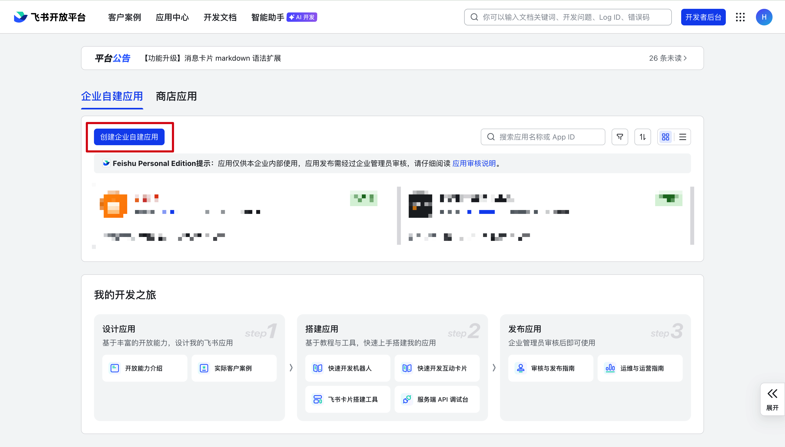

3. 填写：
   - **应用名称**：`AWS TechBot`（或你喜欢的名字）
   - **应用描述**：`AWS 技术助手`
4. 点击 **创建**

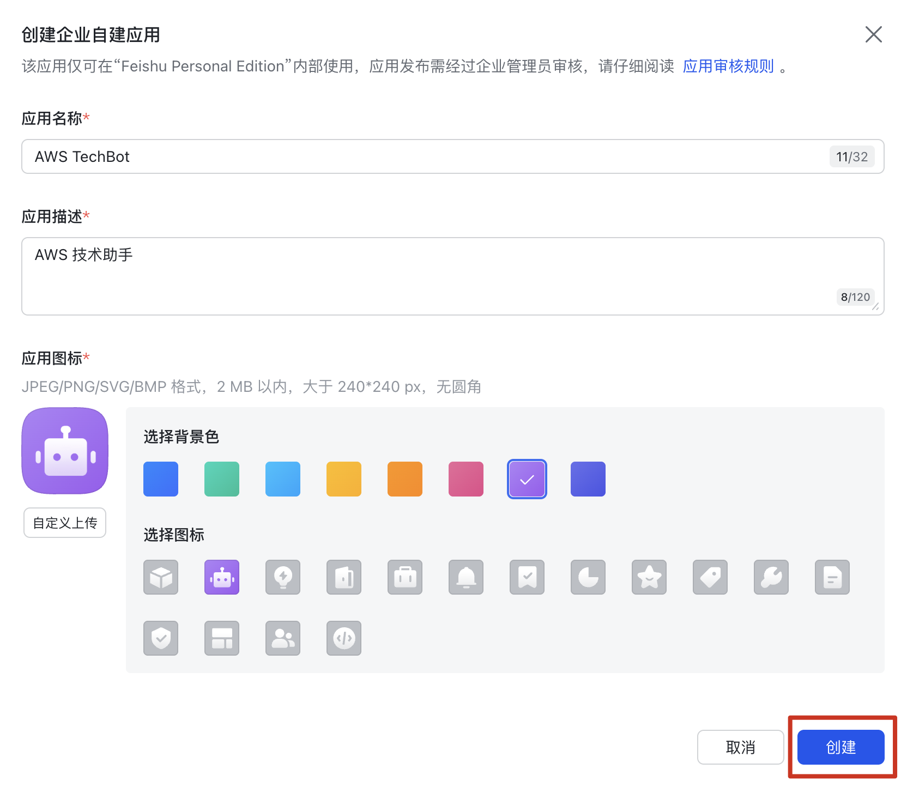

## 第二步：获取 App ID 和 App Secret

1. 在应用管理页面，进入 **凭证与基础信息**
2. 复制 **App ID** 和 **App Secret** — 部署 CloudFormation 时需要填写

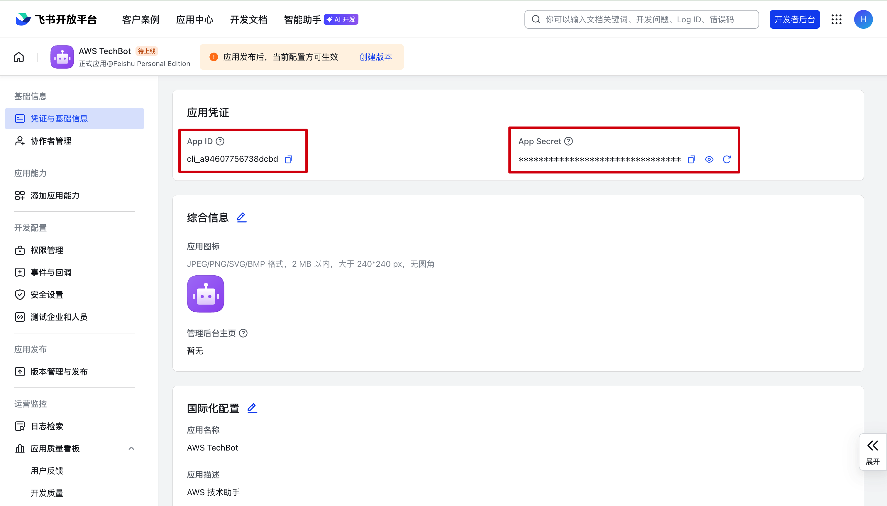

> 请妥善保管 App Secret。在 CloudFormation 参数中填写时会加密处理，不会明文显示。

## 第三步：启用机器人能力

1. 进入 **应用功能** → **添加应用能力** → **按能力添加**
2. 选择 **机器人**，点击 **添加**

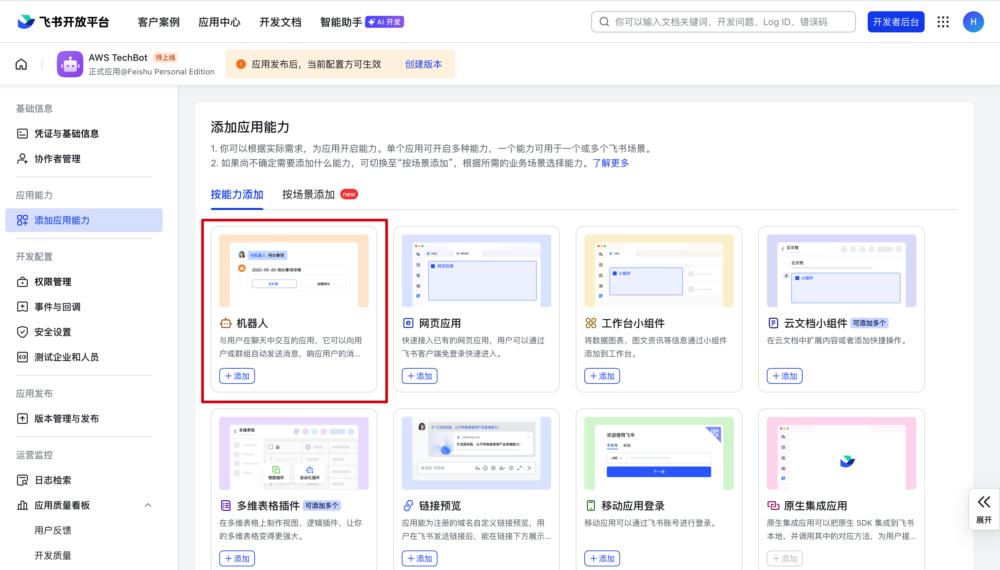

添加之后显示：

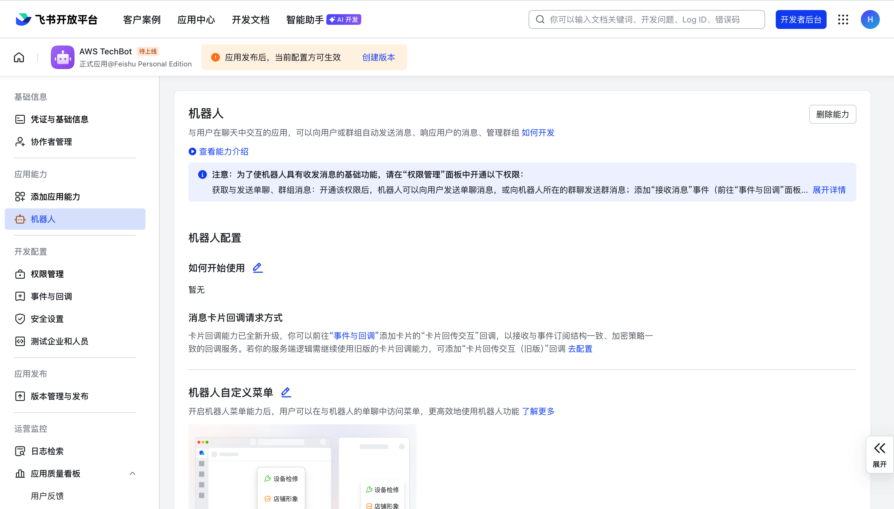

## 第四步：配置权限

1. 进入 **权限管理**
2. 点击 **批量导入/导出权限**

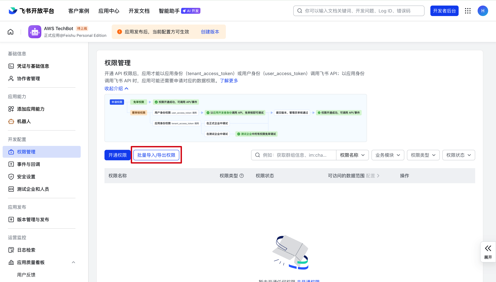

3. 复制以下json并添加以下权限：

```json
{
  "scopes": {
    "tenant": [
      "contact:user.base:readonly",
      "contact:user.employee_id:readonly",
      "im:chat:readonly",
      "im:message",
      "im:message.group_at_msg:readonly",
      "im:message:readonly",
      "im:message:send_as_bot",
      "im:message:update",
      "im:resource"
    ],
    "user": []
  }
}
```

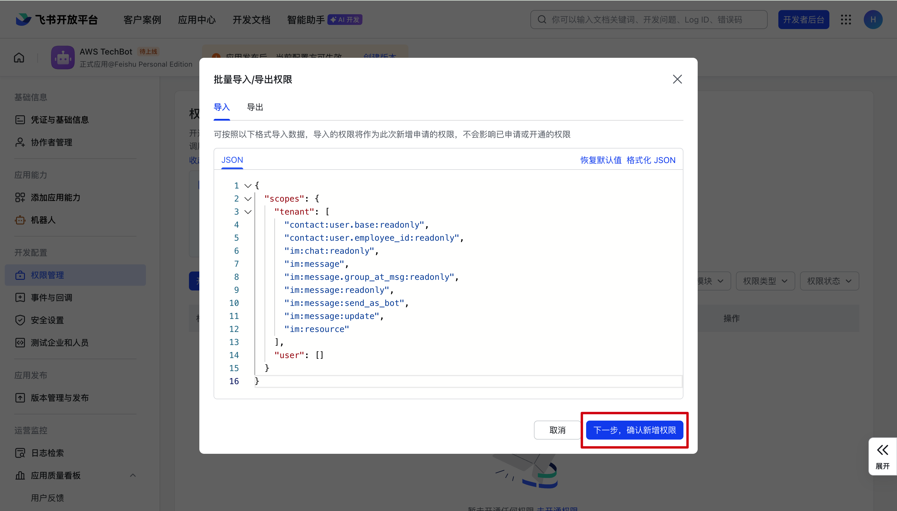

4. 点击 **下一步，确认新增权限**

---

### ⏸️ 部署 CloudFormation

飞书应用已准备就绪，现在请返回 [README — 一键部署 CloudFormation](../README.md#一键部署-cloudformation)，使用刚才获取的 App ID 和 App Secret 完成堆栈部署。

部署完成后，从 CloudFormation Outputs 中复制 **FeishuEventSubscriptionUrl**，然后继续下面的步骤。

---

## 第五步：配置事件订阅

1. 进入 **事件与回调** → **事件配置**
2. 点击 **订阅方式**

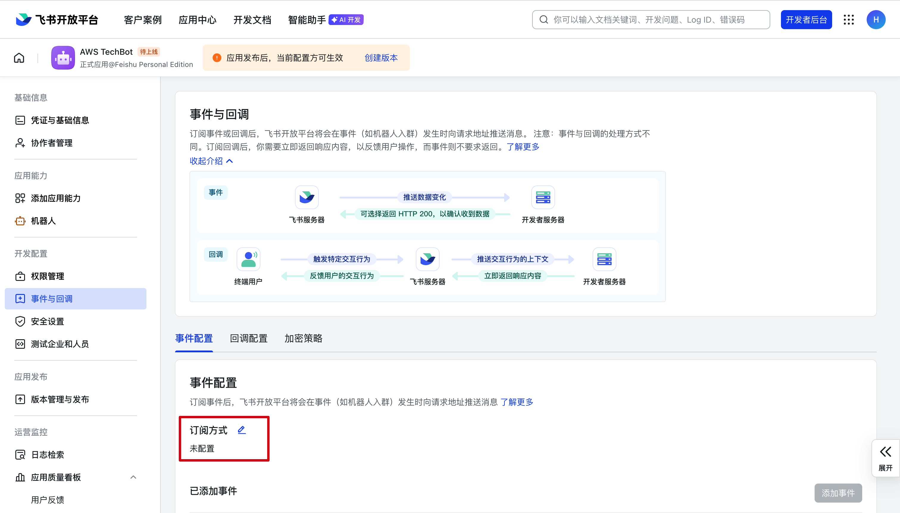

3. 选择 **将事件发送至 开发者服务器**
4. 在 CloudFormation 的 Outputs 中复制 **FeishuEventSubscriptionUrl** 的值：

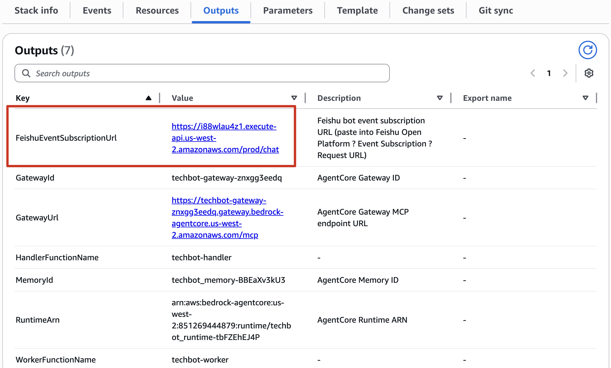

5. 将复制的 URL 填入飞书的 **请求地址** 中：

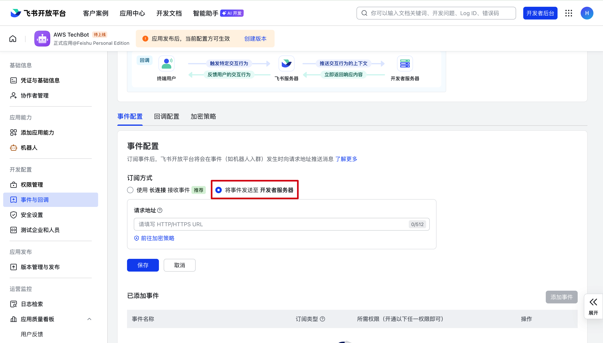

6. 点击保存。飞书会发送验证请求。如果你的 CloudFormation 堆栈已正确部署，应自动显示 **已验证**。

7. 在 **添加事件** 中，搜索并添加：
   - `im.chat.member.bot.added_v1` — 机器人进群
   - `im.chat.member.bot.deleted_v1` — 机器人被移出群
   - `im.message.message_read_v1` — 消息已读
   - `im.message.receive_v1` — 接收消息

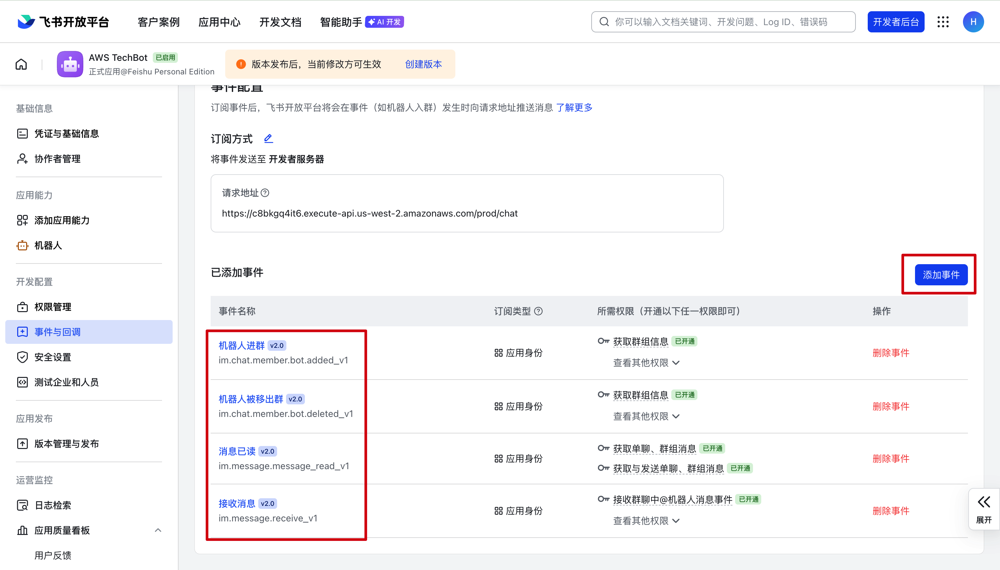

## 第六步：发布应用

1. 进入 **应用发布** → **版本管理与发布**
2. 点击 **创建版本**
3. 填写版本号（如 `1.0.0`）和更新说明
4. 点击 **保存** 进行发布

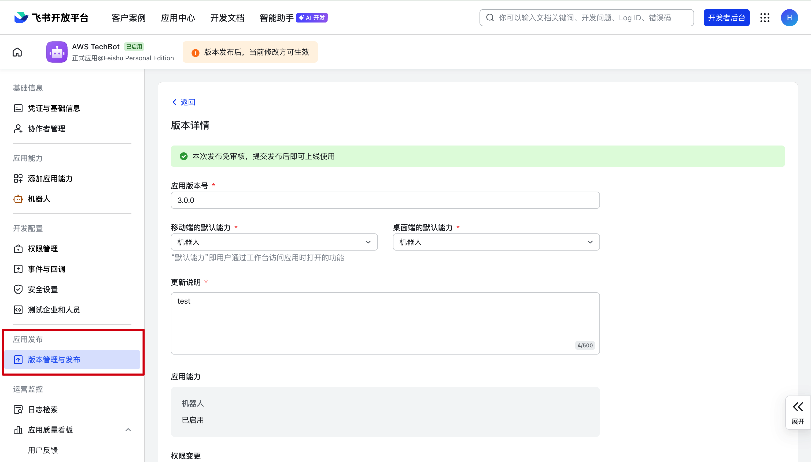

> 应用版本发布并审批通过后，机器人才能正常使用。

## 第七步：将机器人添加到群聊

1. 打开任意飞书群聊/创建群聊
2. 点击右上角的 **···**


3. 点击 **设置**（齿轮图标）→ **群机器人** → **添加机器人**
4. 搜索你的机器人名称并添加

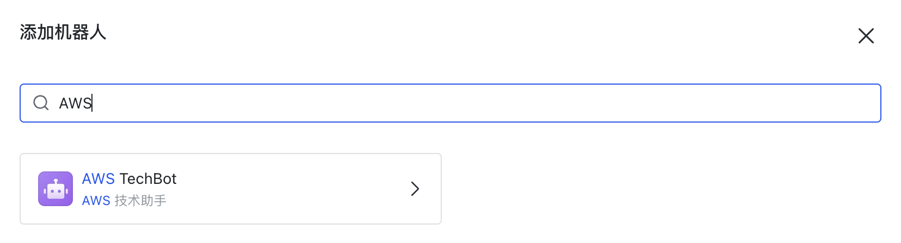

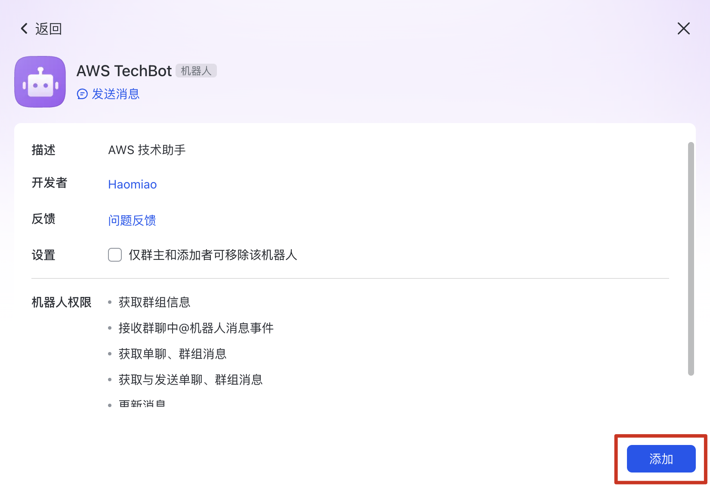

## 第八步：测试（使用 GLM-5 模型）

在群聊中发送消息：首先输入 **@**，选择机器人

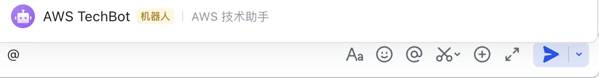

提问：
**S3有哪些存储类型？**

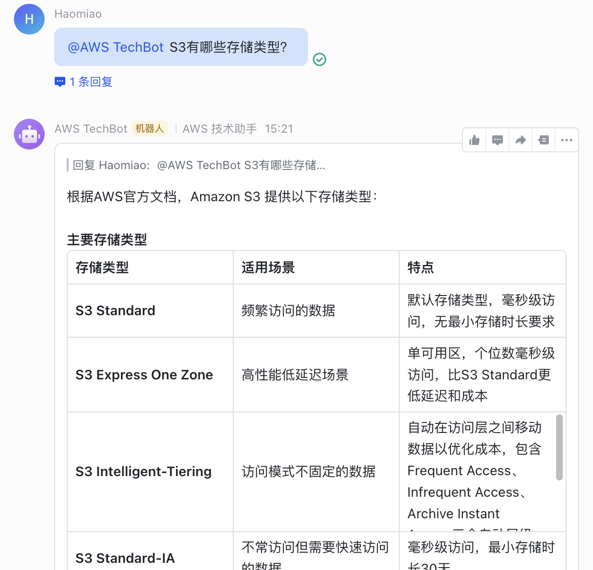

## 常见问题

**机器人没有响应**
- 检查 CloudFormation 堆栈状态是否为 `CREATE_COMPLETE`
- 确认飞书事件订阅中的请求地址（FeishuEventSubscriptionUrl）设置正确
- 查看 CloudWatch 中 Handler Lambda 的日志

**Challenge 验证失败**
- 确保在设置事件订阅地址之前，堆栈已完全部署成功
- 检查 API Gateway 的 stage 是否为 `prod`

**机器人回复错误信息**
- 查看 CloudWatch 中 Worker Lambda 的日志
- 确认 CloudFormation 参数中的 Feishu App ID 和 App Secret 填写正确
- 确保 AgentCore Runtime 正在运行（在 Bedrock 控制台查看运行状态）

**图片无法处理**
- 确保已添加并审批 `im:resource` 权限
- 单张图片不能超过 5MB
