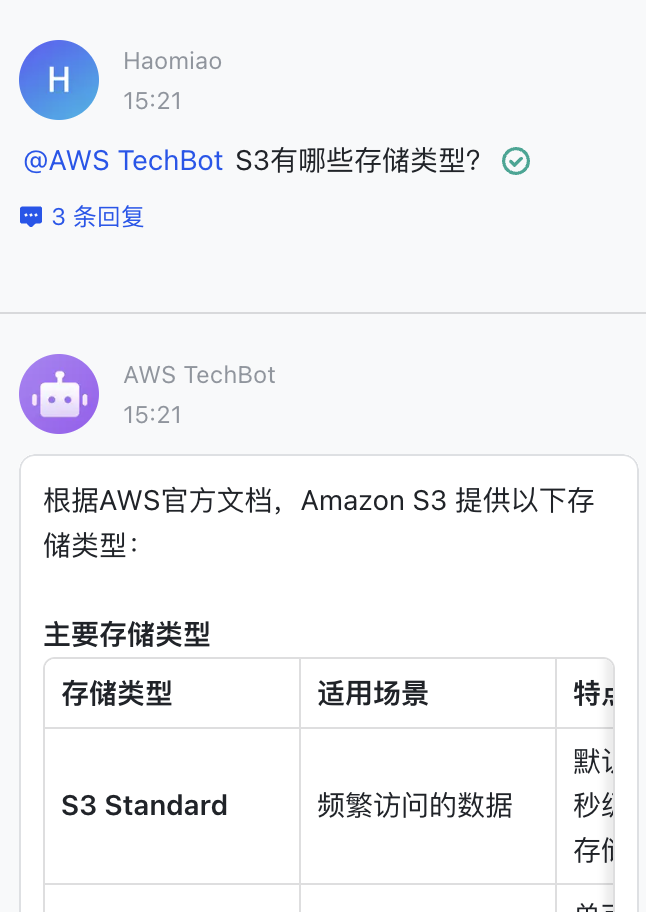
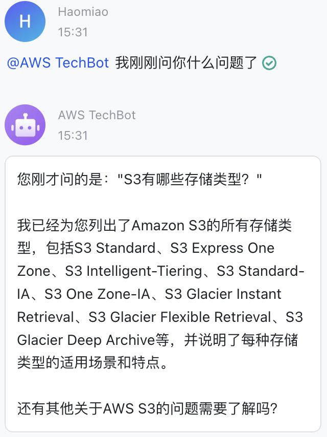
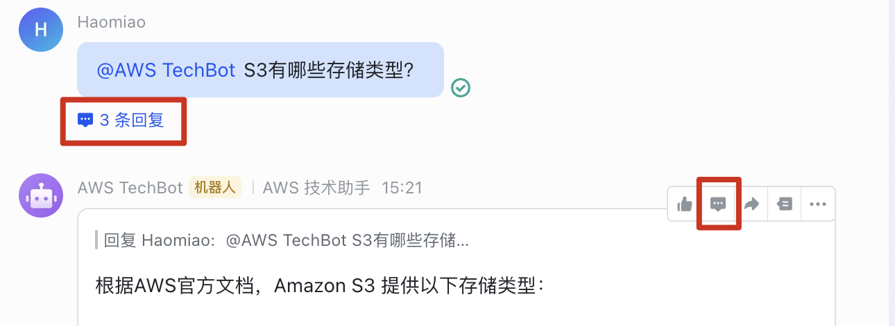
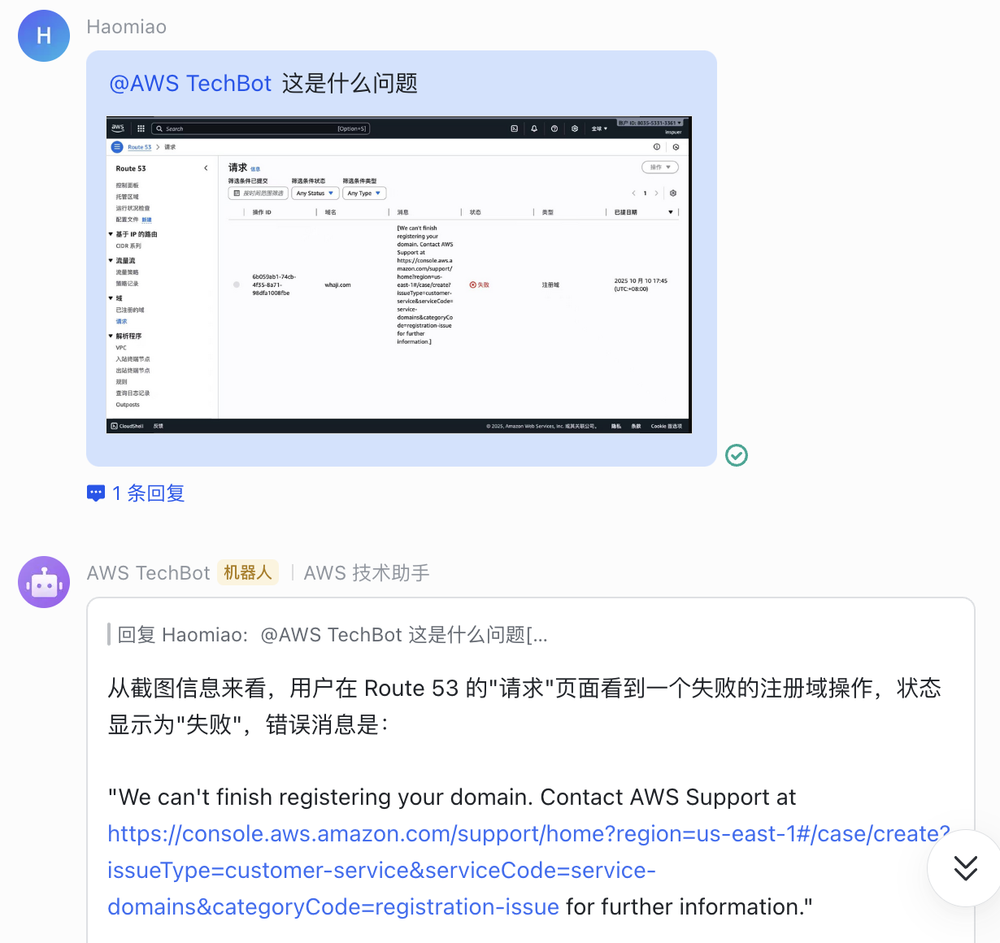

# TechBot 使用教程

本教程介绍 TechBot 的功能和使用方法，帮助你快速上手。

## 基本用法

在飞书群聊中 **@TechBot（或者您定义的机器人名字）** 后输入你的问题即可。TechBot 会根据问题内容自动选择合适的工具进行回答。

支持中英文提问，TechBot 会自动匹配你的语言进行回复。

## 功能一览

### 1. AWS 文档与技术咨询（全球区域）

默认情况下，TechBot 会使用 **aws-global-knowledge** 检索 AWS 官方文档、博客、最佳实践和架构指导。

**示例问题：**
- `@TechBot S3 有哪些存储类型？`
- `@TechBot 如何配置 ALB 的跨区域负载均衡？`
- `@TechBot ECS 和 EKS 怎么选？`
- `@TechBot Lambda 函数超时怎么排查？`
- `@TechBot RDS Multi-AZ 和 Read Replica 有什么区别？`

### 2. 中国区域查询

当你的问题涉及 **中国区**、**北京区域**、**宁夏区域**、**cn-north-1** 或 **cn-northwest-1** 时，TechBot 会自动切换到 **aws-china-knowledge**，查询中国区域的文档和服务可用性。

**示例问题：**
- `@TechBot Bedrock 在中国区可用吗？`
- `@TechBot 北京区域支持哪些 EC2 实例类型？`
- `@TechBot 宁夏区域的 S3 和全球区有什么差异？`
- `@TechBot China region 支持 GuardDuty 吗？`

> 如果不明确指定区域，TechBot 默认按全球区域回答。需要查询中国区信息时，请在问题中提及"中国区"、"北京"、"宁夏"等关键词。

### 3. 实时价格查询

涉及定价、费用、成本的问题，TechBot 会调用 **aws-pricing** 获取实时价格数据。支持全球和中国区域。

**示例问题：**
- `@TechBot us-east-1 的 m7i.xlarge 每小时多少钱？`
- `@TechBot S3 Standard 在 ap-southeast-1 的存储单价是多少？`
- `@TechBot 对比一下 r6g 和 r7g 在 us-west-2 的价格`
- `@TechBot 北京区域的 c6i.2xlarge 价格`

### 4. 客户案例检索

需要了解真实客户如何使用 AWS 时，TechBot 会调用 **aws-customer-stories** 检索客户成功案例。

**示例问题：**
- `@TechBot 有哪些金融行业使用 AWS 的案例？`
- `@TechBot 游戏行业的 AWS 客户故事`

## 多轮对话

如果部署时启用了 **AgentCore Memory**，TechBot 支持多轮对话，能记住之前的对话内容。即使你没有重复上下文，TechBot 也能理解你在问什么。

```
你：@TechBot Lambda 的最大超时时间是多少？
Bot：Lambda 函数的最大超时时间为 15 分钟（900 秒）...

你：@TechBot 那内存上限呢？
Bot：Lambda 函数的最大内存为 10,240 MB（10 GB）...
```

例如，先问一个问题"S3有哪些存储类型"，再追问"我刚刚问你什么"，TechBot 能准确回忆：

 

**使用技巧：**
- 在群聊中对话的详情页中继续@TechBot，可以维持对话历史
- 同一详情页内的对话会共享上下文，TechBot 能理解"那"、"它"、"上面提到的"等指代
- 不同详情页之间的对话是独立的
- 可以点击下图所示的按钮在详情页中进行回复


## 图片识别（注意：仅 Nova 2 Lite 模型支持图片输入）

TechBot 支持图片输入。你可以发送截图让 TechBot 帮你分析：

- 发送架构图，询问优化建议
- 发送错误截图，让 TechBot 帮你排查问题
- 发送控制台截图，询问配置方法

**使用方式：** 在飞书中选择 **富文本** 消息格式，@ 机器人后插入图片并附上你的问题即可。



> 单张图片不能超过 5MB。

## 注意事项

- TechBot 仅回答 AWS 相关问题，不支持其他云厂商的咨询
- 价格数据为实时查询，以 AWS 官方定价为准
- 中国区和全球区的服务差异较大，请在提问时明确指定区域
- 回复末尾通常会附上参考链接，可点击查看原始文档
