# 企业微信智能机器人配置手册

本手册将引导你在企业微信中创建**智能机器人**并连接到 AWS TechBot。

## 前置条件

- 已有一个企业微信（可用个人身份注册一个测试企业，免费版即可）
- 已完成 CloudFormation 部署（本手册最后需要用到部署输出的回调 URL）

## 第一步：注册企业微信（已有可跳过）

1. 打开 [企业微信官网](https://work.weixin.qq.com/)，点击 **企业注册**
2. 填写企业名称（测试用可随意，如 `xxx-test`）、行业、管理员信息，微信扫码验证
3. 注册完成后进入 [企业微信管理后台](https://work.weixin.qq.com/wework_admin/)

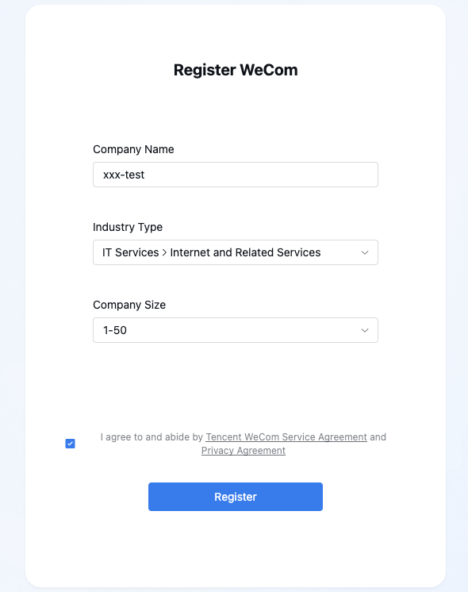

## 第二步：创建智能机器人

1. 点击左侧边栏 **管理工具** → 点击右侧 **智能机器人**

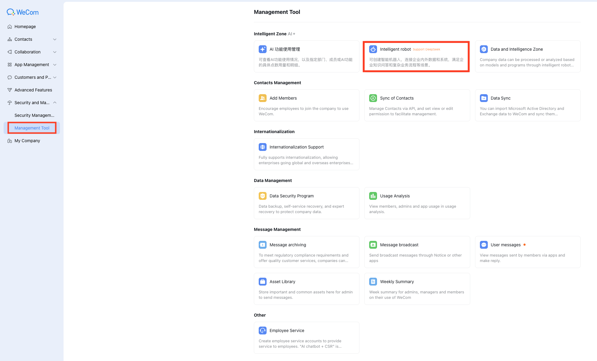

2. 点击**创建机器人** → 点击下方**手动创建**

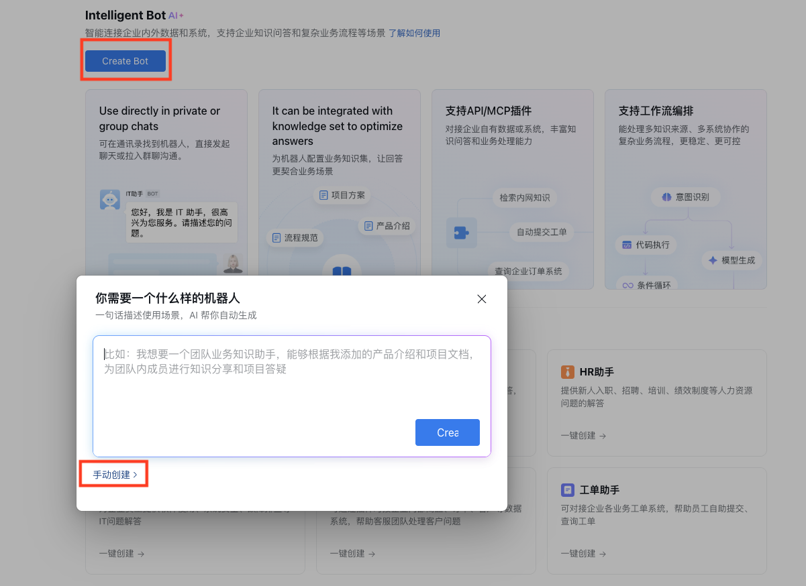

3. 填写：
   - 点击**编辑**图标
   - **机器人名称**：`TechBot`（或你喜欢的名字）
   - **机器人头像 / 简介**：可选
   - 点击**OK**
   - 点击下方去**切换至API模式创建**

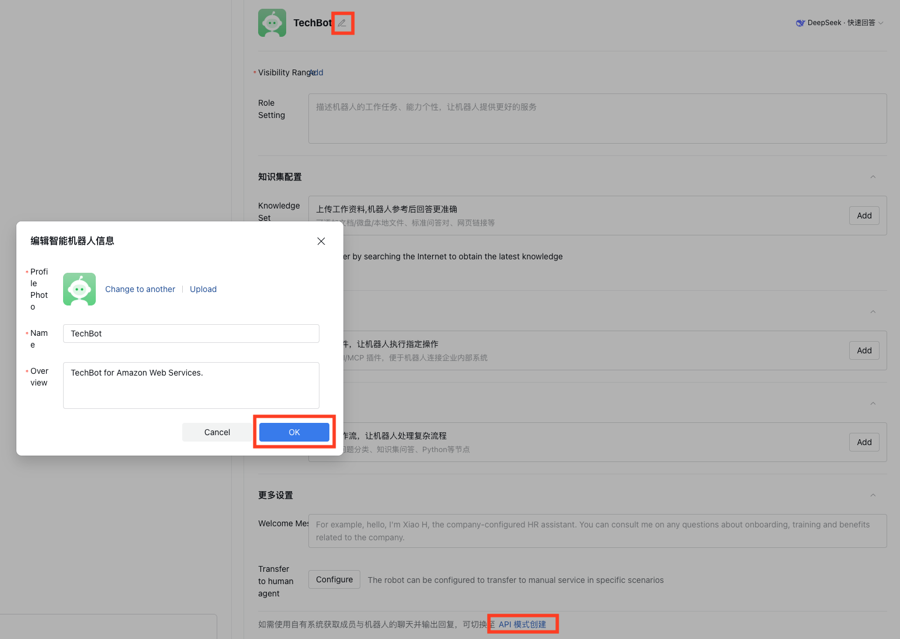

## 第三步：配置 API 接收（URL 回调模式）

进入API模式创建。

1. **连接方式** 选择 **使用 URL 回调**

   > 另一个选项"使用长连接"需要长驻进程，不适合 Lambda。我们用 URL 回调模式。


2. 这里需要填三个值：**URL**、**Token**、**EncodingAESKey**
   - **Token**：点击「随机获取」生成，或自定义（≤32 位）
   - **EncodingAESKey**：点击「随机获取」生成（固定 43 位）
   - **URL**：**先留空**——这个地址需要 CloudFormation 部署完成后才能拿到（见第五步）

3. **先把 Token 和 EncodingAESKey 复制保存下来** — 部署 CloudFormation 时需要填写

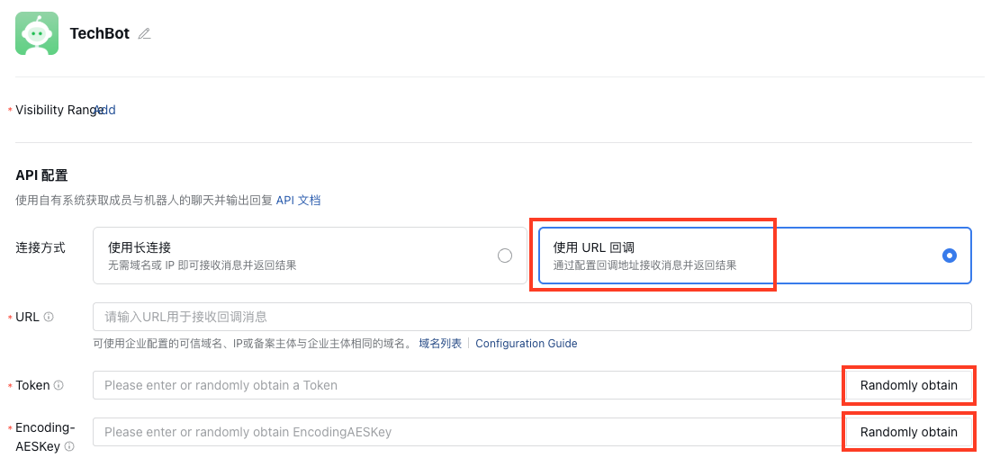

4. 授权**消息**
   - 点击权限中的**消息**，点击**授权**

5. 保留当前页面，不要关闭，继续第四步

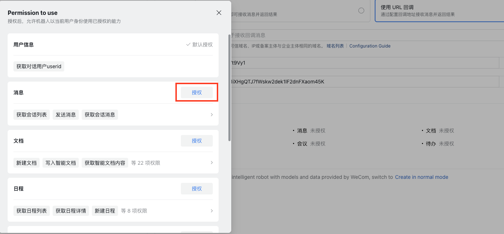

## 第四步：获取企业 ID 和机器人 Secret

1. **企业 ID（CorpID）**：左侧边栏**我的企业** → **企业信息** → 最下方「企业ID」

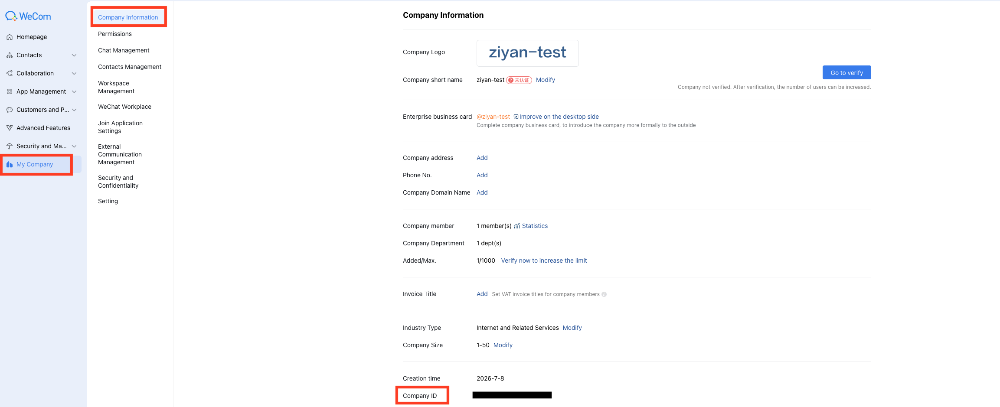

2. **Secret**：回到智能机器人详情页，找到 **Secret**，点击「查看」（会发送到你的企业微信）


> 至此你应该已经拿到 4 个值，部署 CloudFormation 时需要填写：
> - **CorpID**（企业ID）
> - **Secret**（机器人密钥）
> - **Token**（第三步生成）
> - **EncodingAESKey**（第三步生成）
>
> 请妥善保管这些凭证，切勿泄露。

## 第五步：部署 CloudFormation（填入企微参数）

在部署 TechBot 的 CloudFormation 时，填入以下 4 个企微参数（其余参数与飞书部署相同）：

| 参数 | 填写内容 |
|------|---------|
| WeComCorpId | 第四步的企业 ID |
| WeComAgentSecret | 第四步的机器人 Secret |
| WeComToken | 第三步的 Token |
| WeComEncodingAesKey | 第三步的 EncodingAESKey |

> 只要填写了 WeComCorpId，堆栈就会自动创建企微所需的资源（Handler Lambda、Worker Lambda、回调路由、Secrets Manager）。不填则不启用企微功能，不影响飞书。

部署完成后，从 CloudFormation **Outputs** 中复制 **WeComCallbackUrl**，形如：

```
https://xxxxxx.execute-api.us-west-2.amazonaws.com/prod/wework
```

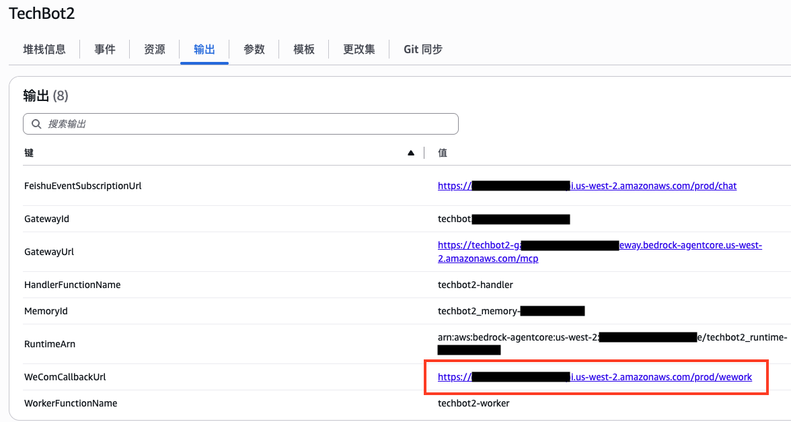

## 第六步：回填回调 URL 并验证

1. 回到智能机器人的 **API 配置** 页面
2. 把第五步的 **WeComCallbackUrl** 填入 **URL** 字段
3. 确认 Token 和 EncodingAESKey 与部署时填写的一致
4. 点击 **保存**

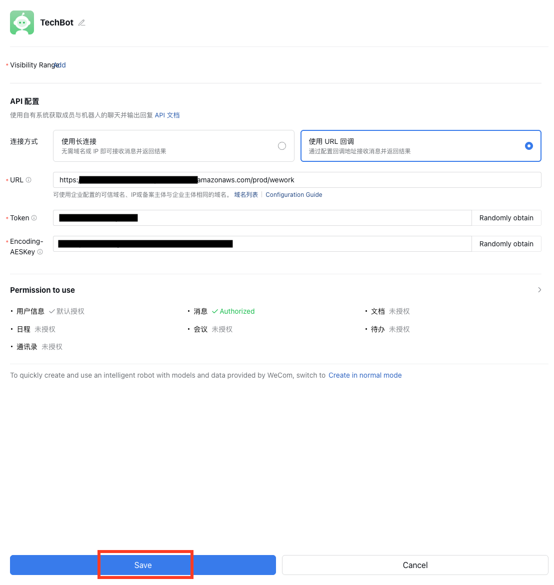

点击保存的瞬间，企业微信会向该 URL 发送一条验证请求。如果保存成功（无报错），说明 URL 验证通过，加解密链路正常。

> **如果保存报错「服务器没有正确响应」**，请见文末常见问题。

## 第七步：将机器人添加到群聊

1. 打开或创建一个企业微信群聊
2. 群设置 → **添加群成员** → **智能机器人** → 选择你创建的 TechBot

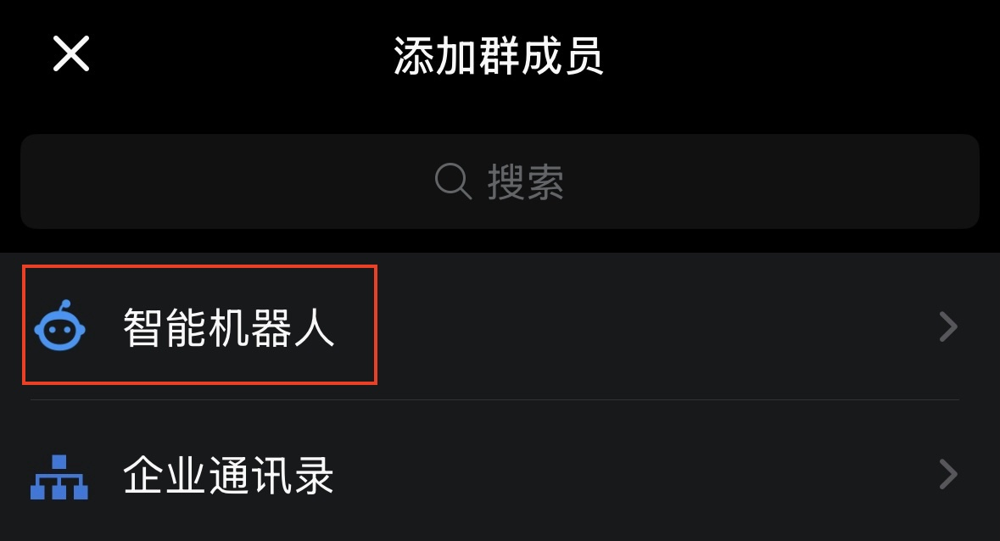

## 第八步：测试

在群里 **@TechBot** 并提问，例如：

**@TechBot S3 有哪些存储类型？**

机器人会在处理完成后（约 30 秒~数分钟，取决于问题复杂度）回复答案。

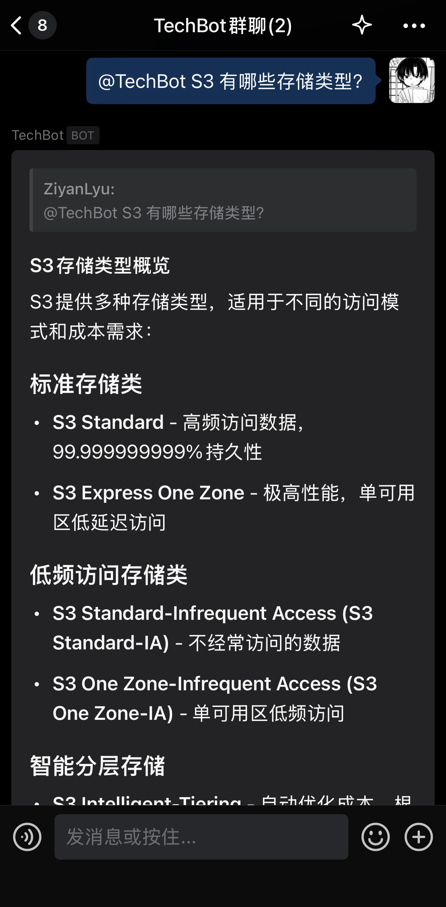

可以继续追问，**长按消息点击引用**，进行多轮对话

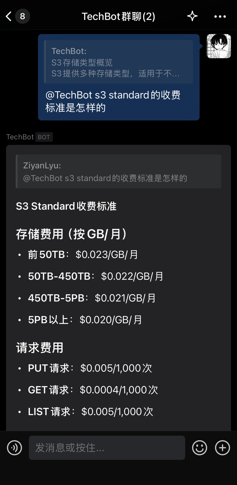

> **提示**：智能机器人通过一次性的 `response_url` 回复，因此回答是**一次性返回完整结果**（不像飞书有实时进度卡片）。提问后请耐心等待。

---

## 常见问题

**保存 URL 时提示「服务器没有正确响应」**
- 确认 CloudFormation 堆栈已完全部署成功（状态 `UPDATE_COMPLETE` / `CREATE_COMPLETE`）
- 确认填写的 Token、EncodingAESKey 与 CloudFormation 参数完全一致
- 确认 API Gateway 的 `/wework` 路由已部署到 `prod` stage（查看 CloudWatch 中 `*-wecom-handler` 日志是否有 `URL verify` 相关记录）

**机器人没有响应**
- 查看 CloudWatch 中 `*-wecom-handler` 日志，确认消息是否成功解密（会打印 `Decrypted message`）
- 查看 `*-wecom-worker` 日志，确认是否成功调用 AgentCore 并回复 `response_url`
- 注意：每个 `response_url` 只能使用一次、有效期 1 小时

**机器人回复错误信息**
- 查看 `*-wecom-worker` 日志中的 AgentCore 调用是否报错
- 确认 AgentCore Runtime 正在运行（Bedrock 控制台查看状态）

**回答被截断**
- 智能机器人 markdown 单条上限约 20480 字节，超长内容会被截断。可拆分提问。
